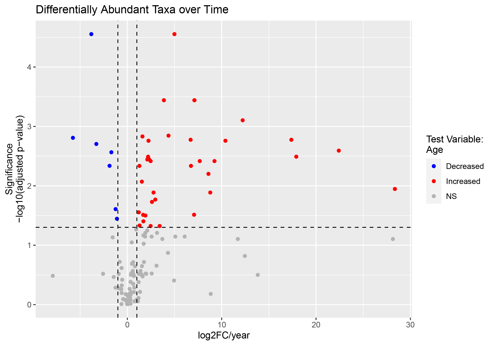
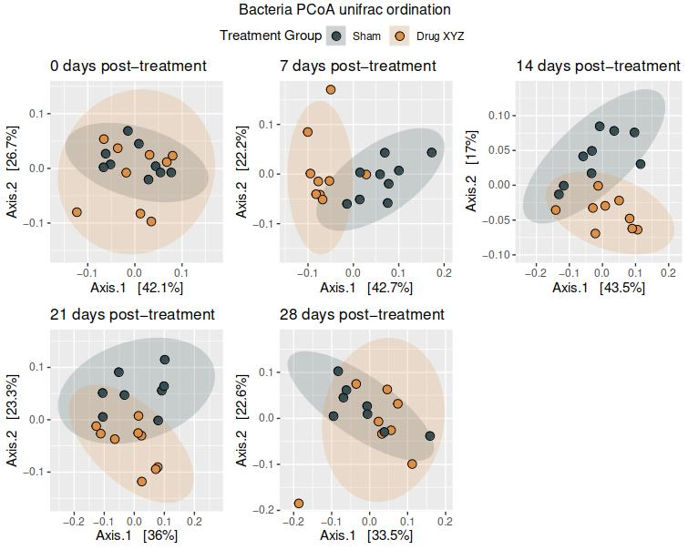

# Downstream analysis

Given that much of the quality control and filtering of our shotgun metagenomic data has already taken place using the Sunbeam pipeline, and we also have taxonomic assignments using the combined power of the Kraken2 and Bracken tools, we do not require as much local pre-processing of data in R before downstream analysis.

## Load Kraken2/Bracken output

The first step is to load in your `all_samples_kraken2.csv` or `all_samples_bracken.csv` file, and extract the OTU ID and consensus lineage information. This will help set you up for preparation of a `phyloseq` container object to hold your data.

We provide a custom function here ([`kraken2_preprocess.R`](https://github.com/respiratory-immunology-lab/microbiome-shotgun/blob/master/downstream/kraken2_preprocess.R)) for producing a taxonomy table and OTU table with unique identifiers from your output file. You may wish to correct the column names after this function however.

The `kraken2_preprocess()` function will return a list with two elements: firstly an object called `kraken2_tax_table` which holds the taxonomy table, and secondly one called `kraken2_otu_table` which holds the OTU read count information (these can be individually extracted using the typical `$` notation).

```{r}
# Read in and pre-process raw kraken2 data
bact_kraken2_input <- kraken2_preprocess(filepath = here::here('input', 'shotgun_data', 'all_samples_kraken2.csv'))

# Extract individual elements
kraken2_otu_table <- bact_kraken2_input$kraken2_otu_table
kraken2_tax_table <- bact_kraken2_input$kraken2_tax_table
```

### Prepare metadata

Your metadata should be prepared with columns in the same order as your OTU table, with identical column names.

### Import data into a phyloseq object

`phyloseq` is an R package to import, store, analyse, and graphically display complex phylogenetic sequencing data that has already been processed.

An example for its creation is given below.

```{r}
# Get data ready for phyloseq creation
otu_mat <- as.matrix(kraken2_otu_table)
tax_mat <- as.matrix(kraken2_tax_table)
samples_df <- sample_metadata

# Use data to create the individual phyloseq object elements
OTU <- otu_table(otu_mat, taxa_are_rows = TRUE)
TAX <- tax_table(tax_mat)
samples <- sample_data(samples_df)
sample_names(samples) <- colnames(otu_mat)

# Import data into a phyloseq object
bact_kraken2 <- phyloseq(OTU, TAX, samples)

# Retain only bacterial taxa
bact_kraken2 <- subset_taxa(bact_kraken2, kingdom == 'Bacteria')

# Remove temp files
rm(list = c('otu_mat', 'tax_mat', 'samples_df', 'OTU', 'TAX'))
```

## Filtering and normalisation

We can now perform some filtration steps to remove samples with low read counts, and also taxa with very few reads or those that are only present in a small number of samples. 

```{r}
# Remove samples with less than [minreadsThreshold] reads
minreadsThreshold <- 10000 # originally set to 10000
bact_kraken2_samples <- prune_samples(colSums(otu_table(bact_kraken2)) > minreadsThreshold, bact_kraken2)

# Filter out taxa based on a minimum number of reads [detectionThreshold] and prevalence [prevalenceThreshold]
detectionThreshold <- 0 # originally set to 0
prevalenceThreshold <- 0.1 # originally set to 0.1
bact_kraken2_filtered <- core(bact_kraken2_samples,
                              detection = detectionThreshold,
                              prevalence = prevalenceThreshold,
                              include.lowest = FALSE)

# Remove samples with less than [minreadsThreshold] reads, after the prevalence filtering.
minreadsThreshold <- 5000 # originally set to 5000
bact_kraken2_filtered <- prune_samples(colSums(otu_table(bact_kraken2_filtered)) > minreadsThreshold, bact_kraken2_filtered)

# Generate a summary of filtration
data_summary <- data.frame('Summary' = c('OTUs/genera', 'Samples'),
                           'Bacteria_before_filtering' = dim(otu_table(bact_kraken2)),
                           'Bacteria_after_filtering' = dim(otu_table(bact_kraken2_filtered)))

# Print the table as a kable object
kable(data_summary) %>%
  kable_styling(bootstrap_options = 'striped', full_width = FALSE)

# Save the filtered phyloseq to an .rds file
bact_kraken2 <- bact_kraken2_filtered
saveRDS(bact_kraken2, here::here('output', 'bact_kraken2.rds'))
```

### Diversity

We can add Shannon diversity index information at this time, so it will be incorporated into any normalised datasets.

```{r}
# Estimate Shannon index
sample_data(bact_kraken2)$Diversity <- estimate_richness(bact_kraken2, split = TRUE, measures = c('Shannon'))$Shannon
```

## Normalisation

Prior to conducting multivariate analysis, it is important to consider the structure of the data. First, high-throughput sequencing data has high variability in library size and therefore differences between samples do not demonstrate true biological diversity. Second, shotgun counts are sparse, with most components containing a zero count. To accommodate for the high variability and sparseness, we require normalisation techniques to improve downstream statistical analysis.

We will use 3 different normalisation methods:

**Centered log ration transformation (CLR)**: 
This normalisation is robust to compositionality. This is the preferred transformation when using some multivariate approaches such as sPLS-DA.

**Cumulative Sum Scaling transformation (CSS)**: 
This normalisation is robust to compositionality and has been specifically developed for microbiome data.

**Log Cumulative Sum Scaling transformation (logCSS)**: 
The log + 1 transformation of CSS-normalised data.

```{r}
# Perform centred log ratio transformation
bact_kraken2_CLR <- microbiome::transform(bact_kraken2, transform = 'clr')
saveRDS(bact_kraken2_CLR, here('output', 'bact_data_CLR.rds'))

# Perform cumulative sum scaling transformation
bact_kraken2_CSS <- bact_kraken2
otu_table(bact_kraken2_CSS) <- 
  otu_table(MRcounts(cumNorm(phyloseq_to_metagenomeSeq(bact_kraken2), p = 0.5)), taxa_are_rows = TRUE)
saveRDS(bact_kraken2_CSS, here('output', 'bact_kraken2_CSS.rds'))

# Perform cumulative sum scaling tranformation followed by log transformation
bact_kraken2_logCSS <- microbiome::transform(bact_kraken2_CSS, transform = 'log')
saveRDS(bact_kraken2_logCSS, here('output', 'bact_kraken2_logCSS.rds'))
```

## Limma wrapper function for differential abundance testing

Say we now want to see whether there are bacteria that are differentially abundant according to some other metadata variable we have available. Perhaps we have information about an individual's age at sampling, or we have some grouping information. This information can be input into a custom wrapper function around the popular `limma` package we provide here, called [`phyloseq_limma()`](https://github.com/respiratory-immunology-lab/microbiome-shotgun/blob/master/downstream/phyloseq_limma.R).

### Arguments for `phyloseq_limma()`

- `phyloseq_object`: a phyloseq object to use for differential abundance testing.
- `metadata_vars`: optional - a character vector of column(s) to keep for DA testing (NOT required if providing a formula).
- `metadata_condition`: optional - a conditional statement about a certain metadata value, e.g. keeping a certain age group only.
- `model_matrix`: optional - best to let the function create the model matrix for you.
- `model_formula_as_string`: just like it sounds - a string containing the model formula you want to use (only works with '+' and not '*' at this stage).
- `use_contrast_matrix`: a boolean selector for whether to use the contrast matrix or a selected coefficient - the function should select the correct option.
- `coefficients`: selection of coefficient(s) you want to be tested. This will depend on the order of variables in the formula, and you can select as many as you'd like (e.g. `coefficients = 2`, or `coefficients = 3:4`).
- `factor_reorder_list`: optional - a named list containing reordered factor values, e.g. `list(Group = c('GroupHealthy', 'GroupTreatment1', 'GroupTreatment2'))`
- `continuous_modifier_list`: optional - a named list containing functions to alter continuous variables, e.g. `list(Age = function (x) x / 365)` to change ages in days to ages in years.
- `contrast_matrix`: optional - best to let the function create the contrast matrix for you.
- `adjust_method`: optional - the method used to correct for multiple comparisons, listed [here](https://www.rdocumentation.org/packages/stats/versions/3.6.2/topics/p.adjust).
- `rownames`: optional - a custom vector of names to be used if you don't wish the names to be automatically derived from taxonomy.
- `tax_id_col`: the phyloseq object `tax_table` column you wish to use for naming - this should match the level being tested.
- `adj_pval_threshold` (default = 0.05): the minimum level deemed significant.
- `logFC_threshold` (default = 1): the minimum log-fold change deemed meaningful.
- `legend_metadata_string`: optional - a custom name for colour or fill options.
- `volc_plot_title`: optional - a custom title for the volcano plot (will be reused for the associated bar plots and individual feature plots).
- `volc_plot_subtitle`: optional - a custom subtitle for the volcano plot (will be reused for the associated bar plots and individual feature plots).
- `volc_plot_xlab`: optional - a custom x label for the volcano plot.
- `volc_plot_ylab`: optional - a custom y label for the volcano plot.
- `remove_low_variance_taxa` (default = FALSE): optional - if TRUE, the phyloseq OTU table will be checked for feature-wise variance, and all features with zero variance will be removed prior to downstream analysis. Limma may throw an error if most of the features have no variance, so this step is sometimes required for certain datasets.
- `plot_output_folder`: optional - the path to a folder where you would like output plots to be saved. If left blank, no plots will be saved.
- `plot_file_prefix`: optional - a string to attach to the start of the individual file names for your plots. This input is only used if the `plot_output_folder` argument is also provided.

### Function output

The function will return a list with different outputs from the function.

- `input_data`: the original OTU data used to run the analysis.
- `input_metadata`: a data.frame with the original metadata you provided.
- `test_variables`: a data.frame with the subset of metadata variables used for the analysis.
- `model_matrix`: the model matrix generated (or provided) to the function.
- `constrast_matrix` OR `coefficients`: either the contrast matrix used, or the coefficients selected, depending on the analysis you chose to run.
- `limma_significant`: a list of data.frames containing the signficant taxa determined by the limma function, with the adjusted p-value and logFC threshold selected, for each comparison/coefficient.
- `limma_all`: a list of data.frames containing the significance levels of DA analysis for all taxa for each comparison/coefficient.
- `volcano_plots`: volcano plots for each of the comparisons/coefficients selected.
- `bar_plots`: bar plots combining significant features for each of the comparisons/coefficients selected. The x-axis shows the log2FC value calculated by limma, with feature names on the y-axis, ordered by the effect magnitude.
- `feature_plots`: individual box plots for each feature, for each of the comparisons/coefficients selected. A significance bar will only be shown for the groups being compared, however all groups (if there are more than two) will be plotted for reference.
- `venn_diagram`: a Venn diagram that will show up when you run the function.

If a plot output folder path is provided, for each comparison/coefficient you have selected, three output .pdf files will be generated (provided there is at least 1 significant difference detected):

- `{plot_file_prefix}_{test_variable + group}_volcplot.pdf`: a volcano plot showing all features, with significant feaetures labelled, decreased features in blue and increased features in red.
- `{plot_file_prefix}_{test_variable + group}_barplot.pdf`: a bar plot showing significant features, with the log2FC on the x-axis and feature name on the y-axis. The y-axis is ordered by the log2FC magnitude, with the lowest at the bottom and highest at the top. Negative log2FC features are coloured blue, while positive ones are coloured red. The output plot automatically resizes depending on the number of variables being plotted.
- `{plot_file_prefix}_{test_variable + group}_featureplots.pdf`: individual box plots for each feature, for each of the comparisons/coefficients selected. A significance bar will only be shown for the groups being compared, however all groups (if there are more than two) will be plotted for reference. These plots are arranged with 12 features to a page (3 columns and 4 rows). Multiple pages will be combined into a single output .pdf file if there are more than 12 significant features.

### Continuous example

If we have longitudinal microbiome sampling, we may want to know which taxa change with time. As there is likely to be little change on a day-to-day basis, we can also modify the age information from days to years. Furthermore, we can even control for potentially confounding factors like individual variation.

```{r}
# Run custom limma continuous function for taxa vs age
bact_limma_age <- phyloseq_limma(phyloseq_object = bact_kraken2_logCSS,
                                 model_formula_as_string = '~ Age + Individual',
                                 tax_id_col = 'taxa',
                                 continuous_modifier_list = list(Age = function (x) x / 365),
                                 coefficients = 2,
                                 volc_plot_title = 'Differentially Abundant Taxa over Time',
                                 volc_plot_xlab = 'log2FC/year')

# View volcano plot
bact_limma_age$volcano_plots$Age
```

This will produce a volcano plot that looks something like this (the taxa names have been omitted, but will normally appear):

<div text-align="center">
  
</div>


## Example of splitting a phyloseq

Say you have a single phyloseq object from a time-course study and want to compare the differences between the groups at each discrete time point.

### Beta-diversity

Firstly we may want to assess beta-diversity. Because the taxonomic composition may vary greatly with time, if we were to plot ordination plots for all samples together, we may lose clarity and minimise resolution/separation of data points at each of the time points individually.

In this example, we have 16S rRNA sequencing data (preprocessed via the DADA2 pipeline) at 5 time points of interest in a drug treatment study: we have a zero timepoint, and four subsequent timepoints. We have one drug-treated group and a control sham-treated group. 

To save time and code, let's loop through the ordinations at each timepoint by creating temporary `phyloseq` subsets, add their plotted ordinations to a plot list, and finally combine the plots into a single figure with `ggarrange()`.

```r
# Choose parameters for downstream analyses
met <- 'PCoA'
dist <- 'unifrac'
bact <- bact_data_logCSS

# Bacterial ordination (separately for each temporal group)
ord_list <- list() # blank list to hold ordination plots
for (day in levels(bact@sam_data$days_postTx)) { # loop through the unique values of 'days_postTx' in the phyloseq sample_data()
  bact_tmp <- prune_samples(bact@sam_data$days_postTx == day, bact) # create temporary subsets of the phyloseq object
  
  p <- plot_ordination(bact_tmp, ordinate(bact_tmp, met, dist, weighted = TRUE), # ordinate via the phyloseq plot_ordination() function
                       title = paste0(day, ' days post-Tx')) +
    stat_ellipse(aes(fill = group), geom = 'polygon', type = 't', level = 0.95, alpha = 0.2) + # add group ellipses
    scale_shape_identity() +
    geom_point(aes(fill = group), shape = 21, size = 3) + # add the individual data points
    scale_fill_jama(name = 'Treatment Group') # scale the fill colour using ggsci scale_fill_jama() function
  
  ord_list[[day]] <- p # add the plot to the plot list
}

# Arrange ordination plots using ggpubr ggarrange() function
ord_plots <- ggarrange(plotlist = ord_list, nrow = 2, ncol = 3, common.legend = TRUE)
(ord_plots <- annotate_figure(ord_plots,
                              top = text_grob(label = paste0('Bacteria ', met, ' ', dist, ' ordination'))))
ggsave(here::here('figures', 'ordination', 'bact_PCoA_ordination_by_time.pdf'), ord_plots, # Save combined figure
       width = 20, height = 16, units = 'cm')
```

The resulting output file looks like this:

